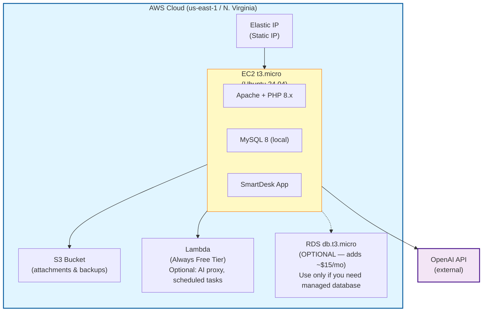

# SmartDesk Ticketing System — AWS Edition

https://is226smartdesk.duckdns.org/

A full-stack PHP/MySQL IT support ticketing system with OpenAI-powered AI features, deployed on Amazon Web Services (EC2 + MySQL + S3).

---

## AWS Architecture



---

## Estimated Monthly Cost (us-east-1)

| Service | Spec | Free Tier | After Free Tier |
|---------|------|-----------|-----------------|
| EC2 | t3.micro Linux 24/7 | $0 (credits) | $8.47/mo |
| EBS | gp3 20 GB | $0 (credits) | $1.60/mo |
| Elastic IP | 1 attached to running instance | $0.00 | $0.00 |
| S3 | 5 GB Standard | $0 (credits) | $0.12/mo |
| Lambda | ~5K invocations/mo | $0.00 | $0.00 (always free) |
| Data Transfer | <100 GB/mo | $0.00 | $0.00 (always free) |
| **Total (recommended)** | | **$0** | **~$10/mo** |
| RDS (optional) | db.t3.micro MySQL + 20 GB | $0 (credits) | +$15.19/mo |

**Free Tier:** New AWS accounts get up to $200 in credits covering ~6 months of usage.

---

## Quick Start — AWS Deployment

### Prerequisites

- An AWS account (free tier eligible)
- AWS CLI installed and configured (`aws configure`)
- An OpenAI API key
- A terminal with SSH

### Step 1: Launch EC2 Instance

**Option A: AWS Console (easiest)**

1. Go to **EC2 → Launch Instance**
2. Name: `it-helpdesk`
3. AMI: **Ubuntu 24.04 LTS**
4. Instance type: **t3.micro**
5. Key pair: Create or select one
6. Security group: Allow **SSH (22)**, **HTTP (80)**, **HTTPS (443)**
7. Storage: **20 GB gp3**
8. Under **Advanced details → User data**, paste the contents of `deployment/ec2-user-data.sh`
9. Click **Launch Instance**

**Option B: AWS CLI**

```bash
# Run the infrastructure script (creates EC2, security group, EIP, S3)
bash deployment/aws-infrastructure.sh
```

### Step 2: Allocate Elastic IP

1. Go to **EC2 → Elastic IPs → Allocate**
2. Associate the EIP with your instance
3. Note the public IP address

### Step 3: Upload Application Files

```bash
# Replace with your key and IP
KEY="helpdesk-key.pem"
IP="your-elastic-ip"

# Upload all files
scp -i $KEY -r ./* ubuntu@$IP:/var/www/html/

# SSH into the instance
ssh -i $KEY ubuntu@$IP
```

### Step 4: Run Setup Script

```bash
sudo bash /var/www/html/deployment/setup-app.sh
```

This will:
- Create `.env` from template
- Set file permissions
- Create the database and import schema + seed data
- Generate password hashes
- Download RDS SSL certificate

### Step 5: Configure Environment

```bash
sudo nano /var/www/html/.env
```

Set your database credentials and OpenAI API key:

```
DB_HOST=localhost
DB_NAME=it_helpdesk
DB_USER=helpdesk_admin
DB_PASS=your_generated_password
OPENAI_API_KEY=sk-your-key-here
```

### Step 6: Access the Application

Open `http://your-elastic-ip` in your browser.

**Important:** Change the admin password immediately after first login, then delete `hash_passwords.php`:

```bash
sudo rm /var/www/html/hash_passwords.php
```

---

## S3 Setup (for ticket attachments)

1. Create an S3 bucket:
   ```bash
   aws s3 mb s3://your-helpdesk-files --region us-east-1
   ```

2. Block public access:
   ```bash
   aws s3api put-public-access-block --bucket your-helpdesk-files \
       --public-access-block-configuration \
       BlockPublicAcls=true,IgnorePublicAcls=true,BlockPublicPolicy=true,RestrictPublicBuckets=true
   ```

3. Create an IAM user or use an EC2 instance role with S3 access

4. Add S3 credentials to `.env`:
   ```
   AWS_S3_BUCKET=your-helpdesk-files
   AWS_S3_REGION=us-east-1
   AWS_S3_KEY=AKIA...
   AWS_S3_SECRET=your-secret
   ```

---

## Optional: RDS MySQL (separate database)

If you prefer a managed database over MySQL on the EC2 instance:

1. Go to **RDS → Create Database**
2. Engine: **MySQL 8.0**
3. Template: **Free Tier** (or Dev/Test)
4. Instance: **db.t3.micro**
5. Storage: **20 GB gp3**
6. VPC: Same as EC2
7. Security group: Same as EC2 (allows port 3306 internally)
8. Public access: **No**

After RDS is available, update `.env`:
```
DB_HOST=your-rds-endpoint.us-east-1.rds.amazonaws.com
DB_USER=admin
DB_PASS=your-rds-password
```

Then import the schema from your EC2 instance:
```bash
mysql -h your-rds-endpoint.us-east-1.rds.amazonaws.com -u admin -p it_helpdesk < /var/www/html/database/setup.sql
mysql -h your-rds-endpoint.us-east-1.rds.amazonaws.com -u admin -p it_helpdesk < /var/www/html/database/seed.sql
```

---

## Security Hardening (Production)

After initial setup, apply these hardening steps:

```bash
# 1. Restrict SSH to your IP only (replace x.x.x.x)
aws ec2 revoke-security-group-ingress --group-id sg-xxx --protocol tcp --port 22 --cidr 0.0.0.0/0
aws ec2 authorize-security-group-ingress --group-id sg-xxx --protocol tcp --port 22 --cidr x.x.x.x/32

# 2. Delete setup scripts
sudo rm /var/www/html/hash_passwords.php
sudo rm -rf /var/www/html/deployment/

# 3. Protect .env from web access (Apache)
echo '<Files .env>
    Require all denied
</Files>' | sudo tee /var/www/html/.htaccess

# 4. Disable directory listing
echo 'Options -Indexes' | sudo tee -a /var/www/html/.htaccess

# 5. Set APP_DEBUG=false in .env
sudo sed -i 's/APP_DEBUG=true/APP_DEBUG=false/' /var/www/html/.env

# 6. Optional: Install SSL with Let's Encrypt
sudo apt install certbot python3-certbot-apache -y
sudo certbot --apache -d your-domain.com
```

---

## Project Structure

```
it-helpdesk-aws/
├── .env.example                 # Environment config template
├── index.php                    # Entry point
├── login.php                    # Login (no demo credentials shown)
├── logout.php                   # Session destroy
├── dashboard.php                # Admin dashboard
├── hash_passwords.php           # One-time password hash fixer
├── config/
│   ├── env.php                  # Env loader (AWS-compatible)
│   └── database.php             # PDO with RDS SSL support
├── database/
│   ├── setup.sql                # Schema (tables, indexes, FKs)
│   └── seed.sql                 # Sample data (100+ tickets)
├── includes/
│   ├── ai_helper.php            # OpenAI integration
│   ├── auth.php                 # Authentication & RBAC
│   ├── csrf.php                 # CSRF protection
│   ├── flash.php                # Flash messages
│   ├── functions.php            # Helpers
│   ├── header.php               # HTML header/topbar
│   ├── sidebar.php              # Role-based sidebar
│   └── footer.php               # Footer/chat widget
├── modules/
│   ├── tickets/                 # Ticket CRUD + AI actions
│   ├── users/                   # User CRUD
│   ├── staff/                   # Staff CRUD
│   ├── categories/              # Category CRUD
│   ├── ai/                      # AI JSON endpoints
│   ├── reports/                 # 5 reports with charts
│   └── transactions/            # Workflow modules
├── assets/
│   ├── css/app.css              # Styles
│   └── js/app.js                # JavaScript
└── deployment/
    ├── ec2-user-data.sh         # EC2 bootstrap script
    ├── setup-app.sh             # Post-deploy setup
    └── aws-infrastructure.sh    # CLI infra provisioning
```

---

## Features

- **Full CRUD** — Tickets, Users, Staff, Categories
- **Role-Based Access** — Admin, Support Staff, End User
- **Dashboard** — Stats, Chart.js charts, recent tickets
- **SLA Tracking** — Auto-calculated deadlines, breach detection
- **5 Report Pages** — Volume, Resolution Time, Staff Performance, Category Analysis, SLA Compliance
- **AI Features** — Classification, Troubleshooting, Resolution Draft, Summary, Escalation, Chat Widget, Report Insights
- **Security** — CSRF, bcrypt, prepared statements, XSS prevention


---

## Troubleshooting

| Issue | Solution |
|-------|----------|
| Cannot login | Run `php hash_passwords.php` from the web root |
| DB connection error | Check `.env` credentials, verify MySQL is running |
| AI features fail | Verify `OPENAI_API_KEY` in `.env` |
| Permission denied | Run `sudo chown -R www-data:www-data /var/www/html` |
| 403 Forbidden | Check Apache config allows `.htaccess` overrides |
| RDS SSL error | Download cert: `curl -o /etc/ssl/certs/global-bundle.pem https://truststore.pki.rds.amazonaws.com/global/global-bundle.pem` |
| EIP charges | Release unattached EIPs in EC2 → Elastic IPs |

---

## Cost Management Tips

1. **Set a budget alert** in AWS Billing → Budgets → Create budget ($10/mo)
2. **Stop EC2 when not in use** — but release the Elastic IP first to avoid idle charges
3. **Skip RDS** — use MySQL on the EC2 instance to save ~$19/mo
4. **Lambda is always free** at this scale (1M requests/mo free tier never expires)
5. **Monitor S3** — keep attachments small, use lifecycle rules for old data
6. **Data transfer** — 100 GB/mo outbound is free across all AWS services

---

## Author
**Note:**<br>This project was created for educational purposes as part of the IS 226 course. Database files are not included in this repository.
<br><br>
IS 226 - Web Development
<br>
SmartDesk Ticketing System with AI Integration (AWS Edition)
