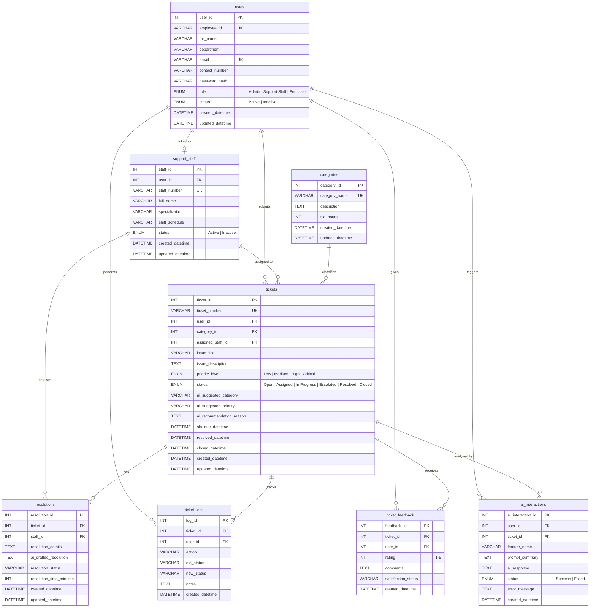

# SmartDesk — Database Entity Relationship Diagram

## ER Diagram

---

## Table Relationships

| Relationship | From | To | Cardinality | FK Column | On Delete |
|---|---|---|---|---|---|
| User submits Tickets | `users` | `tickets` | One-to-Many | `tickets.user_id` | CASCADE |
| User linked as Staff | `users` | `support_staff` | One-to-One (optional) | `support_staff.user_id` | SET NULL |
| User performs Log actions | `users` | `ticket_logs` | One-to-Many | `ticket_logs.user_id` | SET NULL |
| User gives Feedback | `users` | `ticket_feedback` | One-to-Many | `ticket_feedback.user_id` | CASCADE |
| User triggers AI Interactions | `users` | `ai_interactions` | One-to-Many | `ai_interactions.user_id` | SET NULL |
| Staff assigned to Tickets | `support_staff` | `tickets` | One-to-Many | `tickets.assigned_staff_id` | SET NULL |
| Staff resolves Tickets | `support_staff` | `resolutions` | One-to-Many | `resolutions.staff_id` | CASCADE |
| Category classifies Tickets | `categories` | `tickets` | One-to-Many | `tickets.category_id` | SET NULL |
| Ticket has Resolutions | `tickets` | `resolutions` | One-to-Many | `resolutions.ticket_id` | CASCADE |
| Ticket tracks Logs | `tickets` | `ticket_logs` | One-to-Many | `ticket_logs.ticket_id` | CASCADE |
| Ticket receives Feedback | `tickets` | `ticket_feedback` | One-to-Many | `ticket_feedback.ticket_id` | CASCADE |
| Ticket analyzed by AI | `tickets` | `ai_interactions` | One-to-Many | `ai_interactions.ticket_id` | SET NULL |

---

## Table Descriptions

### `users`
Central user table for all system accounts. Supports three roles: Admin (full access), Support Staff (ticket handling), and End User (ticket submission). Each user has a unique employee ID and email.

### `support_staff`
Extended profile for users with the Support Staff role. Links to the `users` table via optional foreign key. Stores specialization area (Hardware, Software, Network, etc.) and shift schedule. A user account can exist without a staff record, and vice versa.

### `categories`
Ticket classification categories with configurable SLA hours. Each category defines the baseline SLA target used to calculate ticket deadlines. Priority level multipliers are applied at the application level.

### `tickets`
Core table storing all support tickets. Each ticket is submitted by a user, optionally assigned to a staff member, and classified under a category. Tracks the full lifecycle from Open through Closed. Includes AI-generated fields for suggested category, priority, and classification reasoning.

### `resolutions`
Stores resolution details when a ticket is resolved. Links to both the ticket and the resolving staff member. Tracks resolution time in minutes and optionally stores the AI-drafted resolution text that was reviewed and edited by staff before submission.

### `ticket_logs`
Audit trail for all ticket state changes. Every status transition, assignment, escalation, and resolution is logged with the acting user, previous/new status, and optional notes. Used for the activity log on the ticket detail page.

### `ticket_feedback`
User satisfaction feedback submitted when closing a ticket. Rating is on a 1-5 scale with a derived satisfaction status (Very Satisfied, Satisfied, Neutral, Unsatisfied). One feedback record per ticket closure.

### `ai_interactions`
Log of all OpenAI API calls made through the system. Tracks which feature was used (Classification, Troubleshooting, Resolution Draft, Summary, Escalation, Chat, Report Insights), the prompt sent, the AI response received, and whether the call succeeded or failed.

---

## Indexes

| Table | Index Name | Columns | Purpose |
|---|---|---|---|
| `users` | `idx_users_role` | `role` | Filter by role |
| `users` | `idx_users_status` | `status` | Filter active/inactive |
| `users` | `idx_users_email` | `email` | Login lookup |
| `support_staff` | `idx_staff_status` | `status` | Filter active staff |
| `support_staff` | `idx_staff_specialization` | `specialization` | Filter by expertise |
| `tickets` | `idx_tickets_status` | `status` | Dashboard counts, filters |
| `tickets` | `idx_tickets_priority` | `priority_level` | Priority filtering |
| `tickets` | `idx_tickets_user` | `user_id` | User's tickets lookup |
| `tickets` | `idx_tickets_staff` | `assigned_staff_id` | Staff workload queries |
| `tickets` | `idx_tickets_category` | `category_id` | Category reports |
| `tickets` | `idx_tickets_sla` | `sla_due_datetime` | SLA breach detection |
| `tickets` | `idx_tickets_created` | `created_datetime` | Date range reports |
| `resolutions` | `idx_resolutions_ticket` | `ticket_id` | Resolution lookup |
| `ticket_logs` | `idx_logs_ticket` | `ticket_id` | Activity log display |
| `ticket_logs` | `idx_logs_created` | `created_datetime` | Chronological ordering |
| `ticket_feedback` | `idx_feedback_ticket` | `ticket_id` | Feedback lookup |
| `ai_interactions` | `idx_ai_feature` | `feature_name` | Filter by AI feature |
| `ai_interactions` | `idx_ai_status` | `status` | Success/failure filtering |
| `ai_interactions` | `idx_ai_created` | `created_datetime` | Chronological log |
